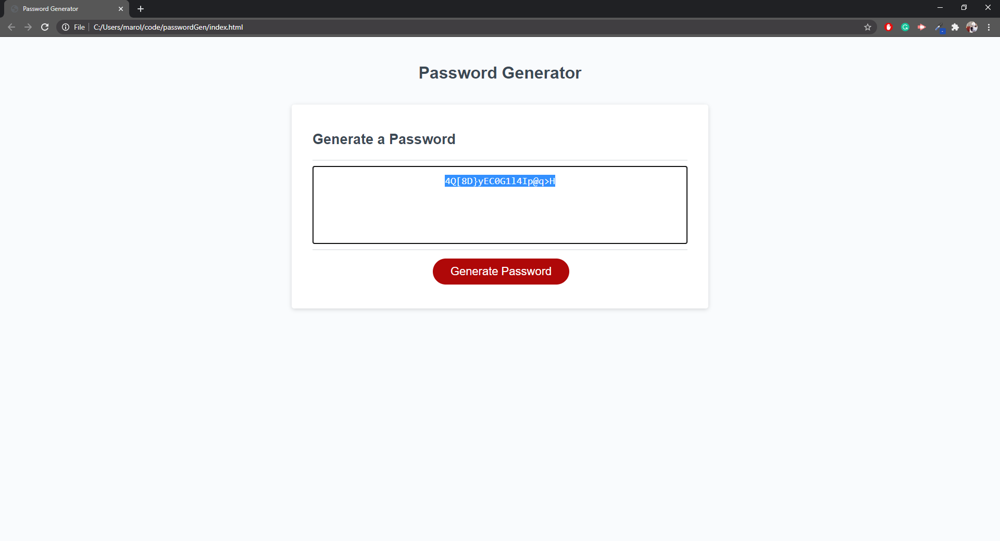

# Password Generator

## Description

This password generator will randomly generate a password that meets criteria set by the user. This can create a password that:
* Has between 8 and 128 characters
* Contains any combination of uppercase, lowercase, numbers, or special characters

It's easy for any user to make a randomly-generated password that meets the requirements of any website or software. Random password generation helps improve security by ensuring passwords aren't shared across apps and don't contain easy-to-guess semantic strings that are the greatest vulnerability for a hacker to exploit.

## Live Website
[Deployed Site: mrjcowman.github.io/passwordGen](https://mrjcowman.github.io/passwordGen)

## Version

